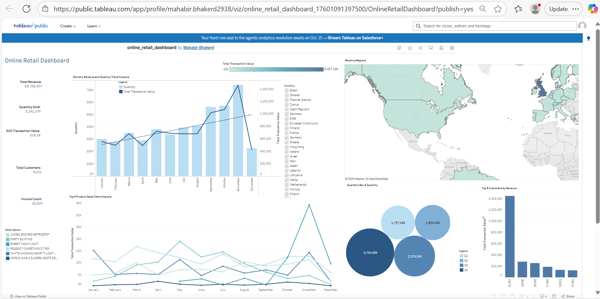

# **Online Retail Analysis - Capstone Project**

Online Retail Analysis is a data driven tool designed to support business decision making through comprehensive analysis and visualisation. Built with Python and key libraries including Pandas, Plotly, Seaborn, Matplotlib, SKLearn, Tableau, the tool ingests raw CSV data, processes it efficiently, and delivers actionable insights via interactive visualisations in both Jupyter Notebook and Tableau.

## **Application of Analytics in the Domain**

Domain: E-commerce / Retail

Data analytics plays a critical role in the e-commerce/ online retail industry by enabling businesses to make informed, data driven decisions. This is through helping businesses understand customer behaviour, optimise inventory, and increase sales. In this dataset, which contains transactional data for an online retail store, analytics was applied to:

- Analyse seasonal trends to understand demand and plan promotional campaigns.

- Identify top-selling products to support marketing and stock decisions.

- Segment customers using RFM (Recency, Frequency, Monetary) analysis to target high value customers more effectively, as well as re-engagement strategies for at risk customer.

- Analyse regional sales patterns to identify high performing markets and opportunities for geographic expansion.

Through the analysis of transaction history, customer behaviour, and website interactions, retailers can uncover sales and purchasing patterns, segment audiences, and optimise product offerings. This leads to more personalised marketing, improved customer retention, smarter inventory management, and enhanced sales forecasting. 

Ultimately, data analytics helps online retailers increase efficiency, reduce costs, and deliver a better shopping experience. This gives the retailer a competitive advantage in a fast paced digital market.

## **AI Solutions and Impact**

To support the analysis, generative AI tools such as GitHub Copilot and ChatGPT were used to speed up data cleaning, create exploratory visualisations, and generate feature engineering ideas.

For example:

- Copilot suggested efficient pandas functions to handle missing values and date conversions.

- ChatGPT was used to brainstorm general ideation and the development of customer segmentation strategies such as RFM cluster analysis by generating ideas to segment and engage different customer types effectively.

These AI tools improved productivity, reduced the time spent on repetitive coding tasks, and supported ideation by providing multiple analytical approaches. This led to faster, more accurate insights into revenue performance, customer behaviour and product management.

# 

## 📘 Table of Contents

1. [Dataset Content](#dataset-content)
2. [Business Requirements](#business-requirements)
3. [Business Goals](#business-goals)
4. [Hypothesis and How to Validate?](#hypothesis-and-how-to-validate)
5. [Project Plan](#project-plan)
6. [Rationale for Visualisations](#rationale-for-visualisations)
7. [Analysis Techniques Used](#analysis-techniques-used)
8. [Ethical Considerations](#ethical-considerations)
9. [Wireframe](#wireframe)
10. [Dashboard Design](#dashboard-design)
11. [KanBan Board](#kanban-board)
12. [Unfixed Bugs](#unfixed-bugs)
13. [Development Roadmap](#development-roadmap)
14. [Deployment](#deployment)
15. [Version Control](#version-control)
16. [Main Data Analysis Libraries](#main-data-analysis-libraries)
17. [Credits](#credits)
18. [Acknowledgements](#acknowledgements)

## Dataset Content

Online Retail Dataset can be found [HERE]( https://www.kaggle.com/datasets/abhishekrp1517/online-retail-transactions-dataset)

The online retail dataset contains transactional data spanning 13 months, including detailed information on products, quantities, prices, purchase timestamps, customer identifiers, and geographic location. 

This dataset is well-suited for analysing customer behaviour, identifying popular products, and informing pricing and marketing strategies. Furthermore, it provides a robust foundation for data analysis and machine learning applications.

Column Descriptors:

- StockCode: A code used to identify the product that was purchased
- Description: A brief description of the product that was purchased
- Quantity: The quantity of the product that was purchased
- InvoiceDate: The date and time that the purchase was made
- UnitPrice: The price of one unit of the product that was purchased
- CustomerID: The unique identifier for the customer who made the purchase
- Country: The country where the customer who made the purchase is located

## Business Requirements

**Sales Performance Analysis**

- Analyse sales trends over time to identify peak periods and seasonal patterns for strategic planning.

**Identifying High Value Customers**

- Segment customers to identify high value and high potential groups, enabling targeted marketing and personalised engagement strategies.

**Enhancing Customer Retention**

- Identify repeat customers and analyse their purchase behaviors—such as purchase frequency and average transaction value to improve loyalty programs.

**Product Performance**

- Determine top selling products and product categories, and evaluate inventory turnover to optimise stock management.

**Geographical Insights**

- Examine sales performance by country or region to target marketing efforts and expand in high potential markets.

**Inventory Management**

- Leverage sales data to make informed inventory decisions prioritising products to stock and identifying slow moving items for discontinuation.

## Business Goals

- **Increase Sales Growth**
    - Implement strategies to increase revenue during periods of low customer activity.

- **Targeted and Personalised Marketing**
    - Use customer data to deliver relevant campaigns that drive engagement.

- **Customer Retention & Acquisition**
    - Strengthen loyalty among existing customers while attracting new ones through focused initiatives.

- **Inventory and Supply Chain Optimisation**
    - Enhance efficiency by aligning stock levels and logistics with demand trends.

- **Sustainable Growth**
    - Leverage analytics to inform long term strategic decisions and business development.

- **Regional market expansion**
    - Identify and enter high potential geographic markets to grow brand presence.

## Hypothesis and how to validate?

**Hypothesis 1** - Customers in the United Kingdom spend more than those not in the United Kingdom per transaction.

- Using a boxplot is effective because it provides a clear visual comparison of distribution, central tendency, and variability between the two groups.

**Hypothesis 2** - Average sales are the same on weekdays and weekends.

- Using a bar chart is effective because it provides a simple and direct visual comparison of group means, which is exactly what the hypothesis is testing. 

**Hypothesis 3** - Seasonal spend - Holiday (Black Friday and Christmas) months have a different average transaction value.

- Using a bar chart to is a great choice because it clearly summarizes and compares average transaction values across categories.

To validate the hypothesis, a t-test will be conducted to obtain the p-value, facilitating the determination of its statistical significance. 

Additionally, the validation process will be supported by visualisations and accompanying commentary within the data visualisations Jupyter Notebook. This commentary will encompass key insights, conclusions, recommendations for improvement, as well as considerations of ethical and societal implications.

Project hypotheses outcome:

- Hypothesis 1:

    -  **False** as non-UK customers spend more per transaction and show greater variability in spending.

- Hypothesis 2:

    - **False** as higher average spending occurs on weekdays.

- Hypothesis 3:

    - **True** as there is a difference in average transaction value between holiday and non-holiday months.

## Project Plan

1. Data Collection
    - Gather the dataset from Kaggle
    - Unzip folder and extract contents to be imported into VSCode
2.  Ethical, Legal and Social Implications
    - Provide the implications and importance of each element.
3. Data Cleaning and Preprocessing
    - Investigate dataset on Microsoft Excel
    - Handle null values, remove duplicates, and correct data types to appropriate ones 
    - Remove irrelevant data (e.g., transactions with negative quantities, product descriptions that are not products such as "damages and ?")
    - Create new features Total Transaction Value (Quantity*UnitPrice)
    - Review
4. Save the cleaned data to a new CSV file
    - Save cleaned dataset as processed data
    - Use descriptive statistics to understand the data
    - Review
5. Explore Data and Visualise
    - Statistics
    - Probability
    - Create visualisations based on sales, customers and products to identify trends and patterns for key insights, conclusions, recommendations and improvements
    - Create monthly trend analysis visualisation with linear trend line
    - Create RFM cluster analysis to identify customer categories
    - Test hypotheses using T Test
    - Create visualisations in line with hypotheses, detailing key insights, conclusions, recommendations and improvements.
    - Commentary on ethical and societal considerations for each hypothesis
    - Overall conclusion
    - Ethical, legal and social considerations
    - Final thoughts
    - Future Developments
    - Store still images in the appropriate folders (plotly charts)
    - Review
6. Dashboard Creation
    - Create wireframe using Figma
    - Use a wireframe and Tableau to plan and create an interactive dashboard that includes key metrics and visualisations in line with the hypotheses
    - Publish Dashboard
    - Store screengrabs of the wireframe and dashboard in the appropriate folders
    - Review
7. README
    - Write comprehensive README document
    - Store KanBan phases images in the appropriate folder
    - Review
8. Submit Project
    - Review 
    - Submit project

## The rationale to map the business requirements to the Data Visualisations

- Enhance Customer Retention and Engagement.

- Enhance Marketing and Strategy for High Value Customers (loyalty & Reward Schemes).

- Optimise Product Offerings and Inventory Management.

- Drive Expansion To Other Regions.

- Drive Strategic Sales Growth.

These business objectives are accomplished through comprehensive data processing and visualisation, enabling a deep understanding of the underlying information. This methodology facilitates the generation of actionable insights and the identification of potential solutions aligned with the business requirements.

In the retail industry, the analysis of sales trends, seasonality, customer spending behaviours, regional exposure, and product preferences is a standard practice employed to inform strategic decision making and enhance business performance.

## Analysis techniques used

**List of techniques used**

ETL Notebook:

- df.duplicated().sum() was used to check for duplicate data.

- df.drop_duplicates() was used to drop duplicate data.

- Converted datatypes to the appropriate types.

- df_info was used to provide an overview of the dataset, list of columns and missing values.

- dropna was used to remove missing values and isnull().sum() to check column for missing values.

- Added a new column in the dataset which consisted of Quantity * UnitPrice.

- info() to provide a summary of the dataset.

- str.contains(r'\?' was used to remove cells which included special characters.

- str.contains(r'[a-z] was used to remove cells which included lower case letters.

- stats_summary was used to provide descriptive statistics.

- to_csv was used to save the clean dataset.

- pd.read_csv was used to load the clean dataset.

Data Visualisation Notebook:

- describe() was used for statistical summary.

- Matplotlib was used to plot a pie chart for probability findings.

- ttest_1samp was used for t testing to obtain p value and t-statistics.

- Hisplot chart used to display distribution of transaction values.

- Matplotlib line+bar chart was used for monthly trend analysis.

- Matplotlib and y_pred was used to create a monthly trend analysis with linear trend line.

- Plotly pie chart was used for sales by day analysis.

- groupby was used in various analysis to group elements together such as CustomerID and Quantity.

- Subplots and axes was used to create 3 visualisation on 1 line displaying top 6 customers by quantity, unit price and then total transaction value.

- Kmeans.fit_predict was used for RFM clustering.

- Scatterplots was used for popular products charts quantity and total transaction value.

- Plotly line chart was used to display the top 6 product sales trend over 13 months.

- ttest_ind was used to validate all 3 hypotheses.

- Boxplot was used to display Customer Spending Comparison: UK vs Non-UK.

- Bar chart was used to display Average Revenue: Weekdays vs Weekends.

- Bar chart was used to display Average Transaction Value: Holiday vs Non-Holiday Months.

I structured the data analysis using a diverse range of techniques drawn from the LMS, incorporating visualisations from libraries such as Seaborn, Matplotlib, and Plotly. Care was taken to apply an appropriate method for each analytical objective, ensuring both variety and relevance in the techniques selected to support the insights being presented.

I chose not to use an area chart for the customer analysis section, as it resulted in a cluttered and less interpretable visual. Instead, I opted for bar charts, which provided a clearer, more concise representation of the data and effectively communicated the intended insights.

In the summary statistics section, the histogram visualisation of the t-test results was omitted, as it provided minimal visual value and did not contribute meaningful insights.

I chose not to include a visual representation of the RFM customer clusters alongside the tabulated results. Although an initial visualisation was created, it did not convey additional meaningful insights beyond what was already presented in the data table. As a result, I opted to summarise this section through key insights, conclusions, and evidence based recommendations. Additionally, ethical and social considerations were included to provide a more comprehensive interpretation of the analysis.

I encountered some challenges when selecting appropriate chart types for specific sections within the data visualisation notebook. To support this decision making process, I utilised AI tools to evaluate the advantages and limitations of various chart types. This allowed me to make informed choices regarding the most suitable visualisation methods for effectively communicating the insights in each context.

I encountered initial challenges when using Figma, as I had no prior experience with the tool. However, with guidance from a colleague who provided a clear explanation of its functionality, I was able to develop a sufficient understanding and the confidence needed to manually construct a wireframe for the project.

AI was utilised during the ideation phase to explore key elements commonly prioritised in online retail businesses. This supported my understanding of relevant business goals and objectives, which informed the development of appropriate business requirements and hypotheses. Additionally, AI tools facilitated the selection of suitable visualisation techniques aligned with the analytical needs of an online retail context.

AI tools were employed to support my understanding of specific coding scripts, particularly those related to statistical methods such as t-tests and probability. This enhanced my conceptual knowledge and provided clarity on the practical implementation of these techniques within the analytical process.

Selected written content was refined with the support of AI tools to enhance clarity, coherence, and adherence to a formal academic writing style.

## Ethical considerations

- The online retail dataset, sourced from Kaggle, presents no legal or societal concerns, as it contains no personal data that could potentially identify or expose individual information. 

- The ETL notebook incorporates a dedicated section addressing the ethical, legal, and social implications associated with data handling practices.

- The data_visualisation notebook includes commentary on ethical and societal considerations relevant to each hypothesis and the RFM customer analysis.

## Wireframe

The dashboard wireframe was developed using Figma to establish a preliminary layout for the dashboard. A search utilising the term “lookscout” within the community section informed the manual creation of the wireframe. 

Key components were incorporated, including summary cards for highlighting essential metrics, as well as various chart types such as line, bar, pie, and map visualisations. 

This wireframe functions solely as a conceptual guide to inform the design of the interactive dashboard. Given its provisional nature, the final dashboard may diverge from the wireframe, with modifications implemented during the development process as necessary.

**Wireframe Design:**

## Dashboard Design

The dashboard was designed to be visually appealing, with a heavy set of key insights and charts to display valuable information.

A consistent blue-teal colour scheme was applied to the dashboard to reduce visual clutter and maintain a clean, cohesive look across all visual elements. This choice not only improves readability, especially in a data rich interfaces, but also supports accessibility as blue-teal tones are generally distinguishable for individuals with common types of colour blindness. This layout enhances the user experience. 

The dashboard design did not replicate the wireframe design in full. After metrics had been created, when it came to placement of the metrics using the wireframe guideline, through review, adjustments were made to ensure readbaility and reduce clutter. Further metrics were created as previous ones did not fit well with the design i wanted and added visual clutter. 

**Online Retail Dashboard** 

This is the main dashboard that represents the summary of the data for example, total revenue, invoices, quantity sold, total number of customers.

Visualisations on the dashboard that was chosen to provide valuable insights are listed below:

- Monthly Revenue and Quantity Trend Analysis (Bar+Line Chart).
- Top 6 Product Sales Trend Analysis (Line Chart).
- Revenue Regions (Map).
- Quarterly Rev & Quantity (Packed Bubbles Chart).
- Top 6 Customers by Revenue (Bar Chart).
- Summary cards included as text boxes; total revenue, quantity sold, total customers and invoice count

All charts have clear titles, labels, and legends to ensure that users can easily understand the information being presented. Interactive elements, such as filters and tooltips, allow users to explore the data in more detail and gain deeper insights.

Worksheet list below:

- Revenue Regions
- Quarterly Rev & Quantity
- Monthly Revenue Trend Analysis
- Top 6 Product Sales Trend Analysis
- Top 6 Customers by Quantity
- Top 6 Customers by Revenue
- Total Revenue
- Total Quantity
- Total Customers
- Invoice Count
- Top 6 Customers - Quantity
- Top 6 Customers - Rev
- Monthly Revenue and Quantity Trend Analysis

Dashboard list:

- Online Retail Dashboard Preview:

## Kanban Board
-  You can find the project board [HERE](https://github.com/users/mobess12/projects/3/views/1)
- You can find multiple screengrabs of the project board within the "kanban" folder which is located in the "assets" folder.

**MoSCoW**

The MoSCoW method was used in this project as a framework for prioritising tasks. It helps distinguish between critical and non-essential requirements, ensuring that key objectives are addressed first and project resources are allocated effectively to what matters most for success. 

- **Must Have**: Non-negotiable items essential for the project's success. 

- **Should Have**:Important features that add significant value but are not essential for immediate delivery.

- **Could Have**: Desirable features that are not necessary but would be nice to have if time and resources allow. 

- **Won't Have**: Features that are not a priority for the current timeframe.

You can find this methodology being used for issues [HERE](https://github.com/users/mobess12/projects/3/views/2?visibleFields=%5B%22Title%22%2C%22Assignees%22%2C%22Status%22%2C%22Labels%22%5D)

Preview:
 

## Unfixed Bugs

- To the best of my knowledge, there are no unresolved bugs present in this project.

## Development Roadmap

- Throughout the project, I did not encounter any major issues. I proactively offered support to peers and, in turn, received valuable advice and insights from fellow students when needed. This collaborative environment significantly enhanced my learning experience.

- Having previously encountered and resolved various technical challenges during the bootcamp, I was able to apply prior knowledge effectively in this project. I utilised past experiences, personal notes, LMS content, and online resources such as Google, along with peer support, to address any uncertainties that arose.

- One area of personal development involved wireframe design, which I had not undertaken before. With guidance from a colleague, I acquired the foundational knowledge required to manually create a custom wireframe for the project.

- Similarly, although I had not previously built a complete Tableau dashboard, I was familiar with certain elements through past experience and had prior exposure to Power BI. I deliberately chose Tableau for this project to challenge myself and expand my skillset in an industry relevant tool. I independently developed the entire dashboard and relied on resources such as YouTube tutorials and online documentation to troubleshoot and refine my work.

- Looking ahead, I intend to further explore and gain proficiency in both VSCode and Tableau, as I recognise the significant value they offer in data analytics. Tableau, in particular, is widely adopted across various industries, making continued practice essential for my professional development.

- To build on these skills, I plan to continue developing small to medium-sized projects in Python using VSCode, alongside creating interactive dashboards in Tableau. This ongoing practice will provide practical experience and support my long term growth in the field of data analytics.

## Deployment
### Tableau

Overview of dashboard creation to publishing:

1. Connect data by importing the dataset into Tableau.

2. Dataset was already clean, therefore already prepared.

3. Create worksheets and build individual visualisations on separate worksheets.

4. Design the dashboard by combining, arranging and resizing visualisations from multiple worksheets into a dashboard workbook. 

5. Add interactivity by incorporating filters, tooltips and more to enable user interaction and dynamic data exploration.

6. Review the dashboard layout and interactivity, making adjustments for responsiveness and user experience.

7. Publish the dashboard to Tableau Public by signing into my account and uploading the workbook.

8. Share the dashboard URL in README to provide access to stakeholders.

- You can find a link to the dashboard [HERE](https://public.tableau.com/views/online_retail_dashboard_17601091397500/OnlineRetailDashboard?:language=en-GB&publish=yes&:sid=&:redirect=auth&:display_count=n&:origin=viz_share_link)

Preview: 

## Version Control

GitHub was used for version control to track changes and manage the development history of the project. Regular commits (60+ commits) were made after every section addition or small changes with descriptive comments. It ensured that changes were recorded systematically, earlier versions could be restored if needed. 

Git commands used:

- git add .
- git commit -m "Descriptive Comment"
- git push

## Main Data Analysis Libraries

- Pandas
- NumPy
- Matplotlib
- Seaborn
- Plotly
- SKLearn
- Scipy

## Credits 

- LMS via Code Institute
- Google
- YouTube
- StackedOverflow
- GeeksForGeeks
- Datacamp
- Medium
- PlotlyCommunityForum
- Chat GPT and other AI engines
- Co-Pilot
- Facilitators
- Colleagues
- VSCode
- Github
- Figma
- Tableau

## Acknowledgements 
- Vasi
- Neil
- Student Colleagues